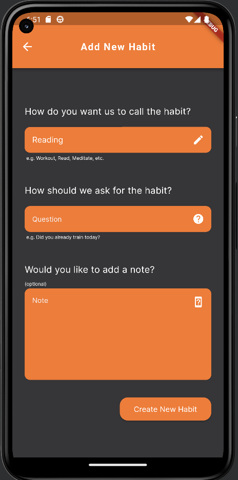

<h1 align="center" id="title">Habit Tracker</h1>

Ein simpler Habit Tracker, der einem täglich eine Checkliste der erledigten Aufgaben zur Verfügung stellt. Dabei werden die ausgewählten Werte dauerhaft gespeichert, sodass man einen regelmäßigen Plan hat. Dieses Projekt diente als Einstieg in die Nutzung von Android Studio, Flutter und Dart. Dabei wurden neue Technologien, wie der Android Emulator verwendet

<h2>Features</h2>

*   Unendliches Scroll Behaviour
*   Lokaler Speicher
*   Multi-Fenster App
*   Fehlermeldung
  
<h2>Project Screenshots:</h2>

  
  
  

